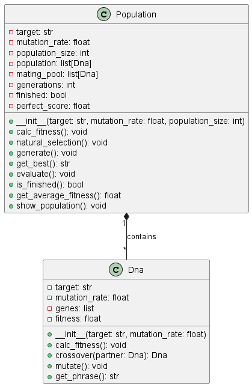

# ThousandMonkeys.py

🐒 **Thousand Monkeys Simulation and Genetic Algorithm Analysis**

ThousandMonkeys.py is a Python script that simulates the famous "thousand monkeys typing on typewriters" thought experiment. It implements a genetic algorithm to explore the idea of random typing eventually producing a specific target text.

## Features

-   🧬 Utilizes a genetic algorithm to mimic the evolutionary process.
-   📜 Allows you to define a target text for the monkeys to generate.
-   🔄 Tracks and displays the progress of the algorithm as it converges towards the target.
